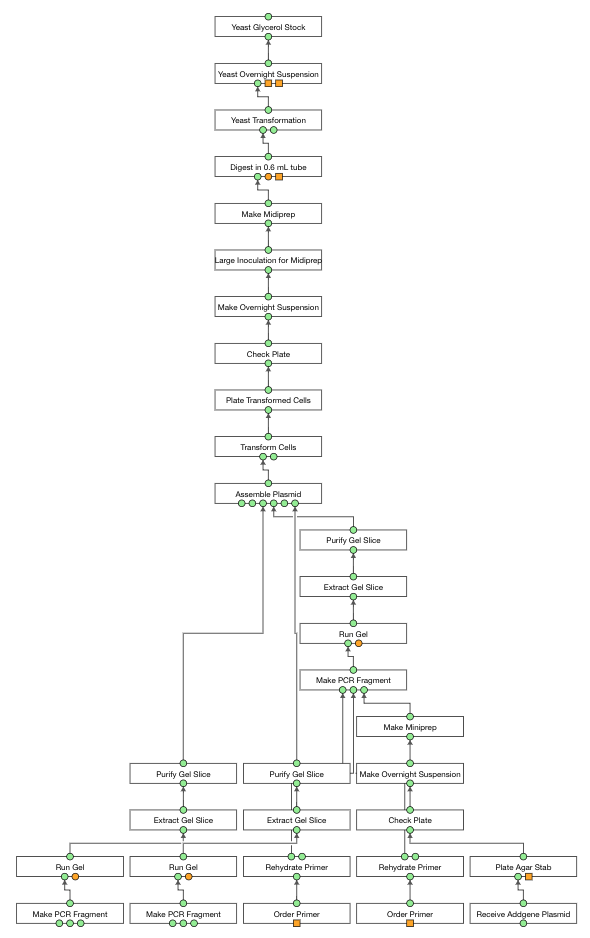
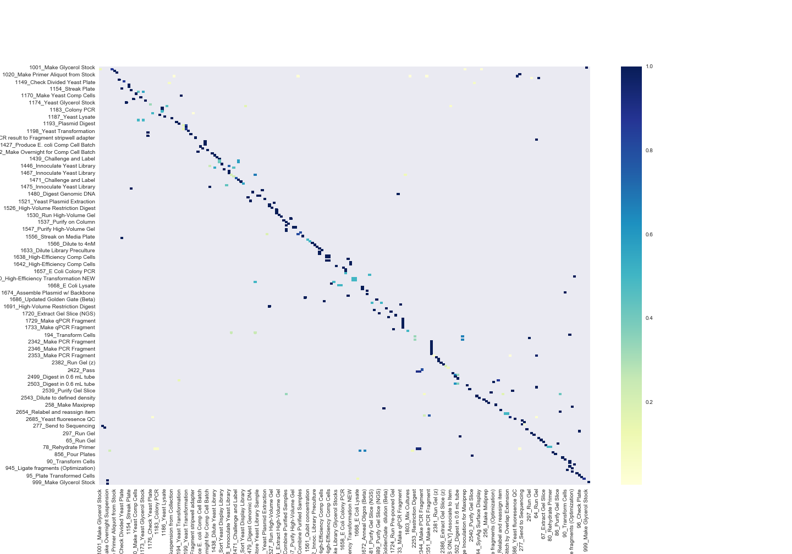

# Aquarium AutoPlanner

This piece of automatically plans scientific experiments in Aquarium using historical
planning data and current laboratory inventory. Data can be pulled from specific researchers
to emulate how that particular researcher would plan experiments.

## Requirements

* development version of **trident (v0.1.0)**
* Python >= 3.6
* Aquarium login credentials

## Usage

Installation:

```python
pip install -U .
```

New models can be built as in the following:

```python
from pydent import AqSession
from autoplanner import AutoPlannerModel
production = AqSession("login", "pass", "url"

# pull last 300 experimental to build model
model = AutoPlannerModel(production, depth=300)
model.build()
models.save('autoplanner.pkl')
```

Saved models can be open later:

```python
model = AutoPlannerModel.load('autoplanner.pkl')
```

What protocols the model uses can be adjusted using filters:

```python
ignore_ots = production.OperationType.where({"category": ["Control Blocks", "Library Cloning"], "deployed": True})
ignore_ots += production.OperationType.where({"name": "Yeast Mating"})
ignore_ots += production.OperationType.where({"name": "Yeast Auxotrophic Plate Mating"})
ignore = [ot.id for ot in ignore_ots]
model.add_model_filter("AllowableFieldType", lambda m: m.field_type.parent_id in ignore)
```

Sample composition:

```python
sample_composition = nx.DiGraph()

# build a new yeast strain from a plasmid, which is comprised of several fragments
edges = [
     ('DTBA_backboneA_splitAMP', 'pyMOD-URA-URA3.A.1-pGPD-yeVenus-tCYC1'),
     ('T1MC_NatMX-Cassette_MCT2 (JV)', 'pyMOD-URA-URA3.A.1-pGPD-yeVenus-tCYC1'),
     ('BBUT_URA3.A.0_homology1_UTP1 (from genome)', 'pyMOD-URA-URA3.A.1-pGPD-yeVenus-tCYC1'),
     ('DH5alpha', 'pyMOD-URA-URA3.A.1-pGPD-yeVenus-tCYC1'),
     ('TP-IRES-EGFP-TS', 'pyMOD-URA-URA3.A.1-pGPD-yeVenus-tCYC1' ),
     ('pyMOD-URA-URA3.A.1-pGPD-yeVenus-tCYC1', 'CEN.PK2 - MAT alpha | his-pGRR-W5-W8-RGR-W36'),
]

for n1, n2 in edges:
    s1 = browser.find_by_name(n1)
    s2 = browser.find_by_name(n2)
    sample_composition.add_node(s1.id, sample=s1)
    sample_composition.add_node(s2.id, sample=s2)
    sample_composition.add_edge(s1.id, s2.id)
```

```python
ignore_items = []  # optional to not include certain items in the search.
desired_object_type = production.ObjectType.find_by_name('Fragment Stock')
cost, paths, graph = network.run(desired_object_type, ignore=ignore_items)
```

```python
# make a new plan
canvas = Planner(production)

# add protocols from optimized network to plan
network.plan(paths, graph, canvas)

# submit to Aquarium
canvas.create()
```

**Example of Planning Yeast Construction**



**Probability Matrix of Connecting Aquarium Protocols**

The autoplanner uses this type of data, in concert with the `sample_composition` network,
to build an optimal experiment.



**Top 50 Connections**


## Future Version

* estimate convidence for certain inventory items or operations based on
past success rate
* better api for
* using 'ghost' plans to build model
* emulating specific users / user groups
** faster execution (currently ~45-60 seconds)

